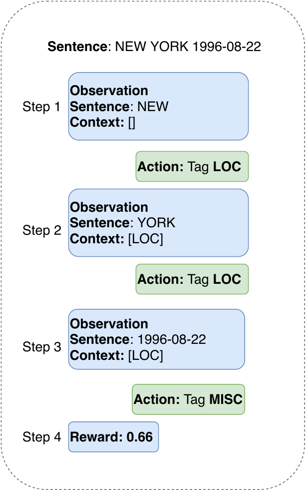
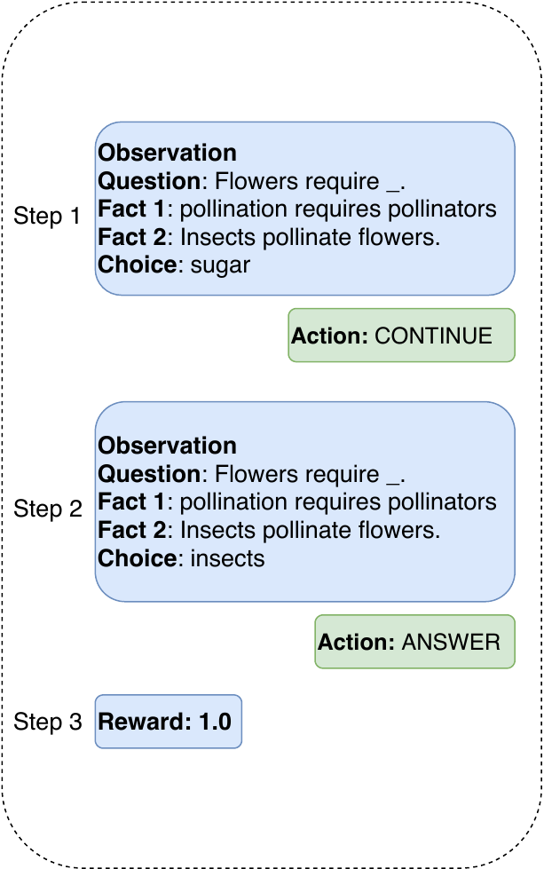
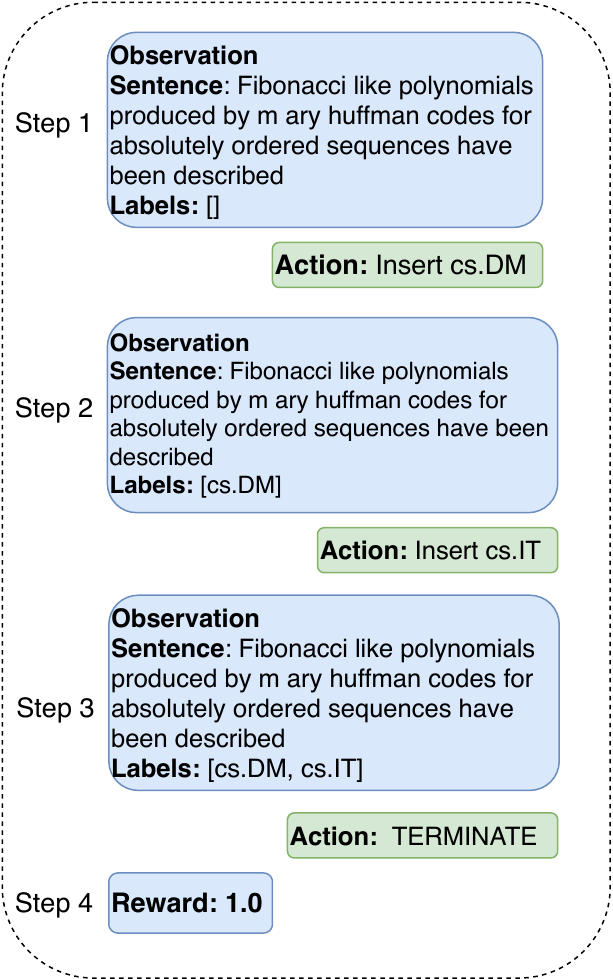

# NLPGym [](https://circleci.com/gh/rajcscw/nlp-gym/tree/main)

NLPGym is a toolkit to bridge the gap between applications of RL and NLP. This aims at facilitating research and benchmarking of DRL application on natural language processing tasks. 

The  toolkit provides interactive environments for standard NLP tasks such as sequence tagging, question answering, and sequence classification. 


Sequence Tagging             |  Question Answering |  Multi-label Classification
:-------------------------:|:-------------------------:|:-------------------------:
 |   |   


- **Sequence Tagging:** Sequence tagging task can be cast as an MDP in which the given sentence is parsed in left-to-right order. At each step, one token is presented to the agent. The actions available to the agent are to TAG with one of the possible labels. The episode terminates when the end of the sentence is reached. By default, reward function is based on entity level F1 scores. It can be either *sparse* given at the end of the episode or *dense* in which at each step, a change in scores between steps is given as reward.


- **Multiple-Choice Question Answering (QA):** The task of QA is to answer a given question by selecting one of the multiple choices. Questions are often accompanied by supporting facts which contain further context.  Selecting the correct option out of all choices can be considered as a sequential decision-making task. At each step, the observation consists of question, facts and a choice. The available actions are (i) ANSWER and (ii) CONTINUE. On ANSWER, the last shown choice is considered as the selection choice and the episode terminates. On CONTINUE, next observation is shown with a different choice. The reward is given only at the end of the episode, either 0 or 1, based on the selected choice's correctness.


- **Multi-Label Classification:** Multi-label classification is a generalization of several NLP tasks such as multi-class sentence classification and label ranking. The task of multi-label classification is to assign a label sequence to the given sentence. In information retrieval, this task corresponds to label ranking when preferential relation exists over labels. Likewise, the task reduces to a simple multi-class classification when any label sequence's maximum length is at most one. In any case, generating this label sequence can be cast as a sequential decision-making task. Similar to sequence tagging, available actions are to INSERT one of the possible labels. Moreover, agents can terminate the episode using the TERMINATE action


The environments provide standard RL interfaces and therefore can be used together with most RL frameworks such as [baselines](https://github.com/openai/baselines), [stable-baselines](https://github.com/hill-a/stable-baselines), and [RLLib](https://github.com/ray-project/ray). 


Furthermore, the toolkit is designed in a modular fashion providing flexibility for users to extend tasks with their custom data sets, observations, and reward functions.


_________________

For more details with respect to observation, reward functions and featurizers, refer to our paper [NLPGym- A toolkit for evaluating RL agents on Natural Language Processing Tasks](https://arxiv.org/abs/2011.08272) which will be presented at [Wordplay: When Language Meets Games @ NeurIPS 2020](https://wordplay-workshop.github.io/)

_________________

# Cite
If you use this repository for your research, please cite with following bibtex:

```
@misc{ramamurthy2020nlpgym,
      title={NLPGym -- A toolkit for evaluating RL agents on Natural Language Processing Tasks}, 
      author={Rajkumar Ramamurthy and Rafet Sifa and Christian Bauckhage},
      year={2020},
      eprint={2011.08272},
      archivePrefix={arXiv},
      primaryClass={cs.CL}
}

```

## Install
```
git clone https://github.com/rajcscw/nlp-gym.git
cd nlp-gym
pip install .
```

To install all the dependencies for using demo scripts: 
```
pip install .["demo"]
```
</hr>

## Usage

The environments follow standard gym interface and following script demonstrates a question answering environment with a random action-taking agent.


```python
from nlp_gym.data_pools.custom_question_answering_pools import QASC
from nlp_gym.envs.question_answering.env import QAEnv

# data pool
pool = QASC.prepare("train")

# question answering env
env = QAEnv()
for sample, weight in pool:
    env.add_sample(sample)

# play an episode
done = False
state = env.reset()
total_reward = 0
while not done:
    action = env.action_space.sample()
    state, reward, done, info = env.step(action)
    total_reward += reward
    env.render()
    print(f"Action: {env.action_space.ix_to
```

To train a DQN agent for the same task:

```python
from nlp_gym.data_pools.custom_question_answering_pools import QASC
from nlp_gym.envs.question_answering.env import QAEnv
from nlp_gym.envs.question_answering.featurizer import InformedFeaturizer
from stable_baselines.deepq.policies import MlpPolicy as DQNPolicy
from stable_baselines import DQN
from stable_baselines.common.env_checker import check_env


# data pool
data_pool = QASC.prepare(split="train")
val_pool = QASC.prepare(split="val")

# featurizer
featurizer = InformedFeaturizer()

# question answering env
env = QAEnv(observation_featurizer=featurizer)
for sample, weight in data_pool:
    env.add_sample(sample, weight)

# check the environment
check_env(env, warn=True)

# train a MLP Policy
model = DQN(env=env, policy=DQNPolicy, gamma=0.99, batch_size=32, learning_rate=1e-4,
            double_q=True, exploration_fraction=0.1,
            prioritized_replay=False, policy_kwargs={"layers": [64, 64]},
            verbose=1)
model.learn(total_timesteps=int(1e+4))
```

Further examples to train agents for other tasks can be found in [demo scripts](https://github.com/rajcscw/nlp-gym/tree/main/demo_scripts)
